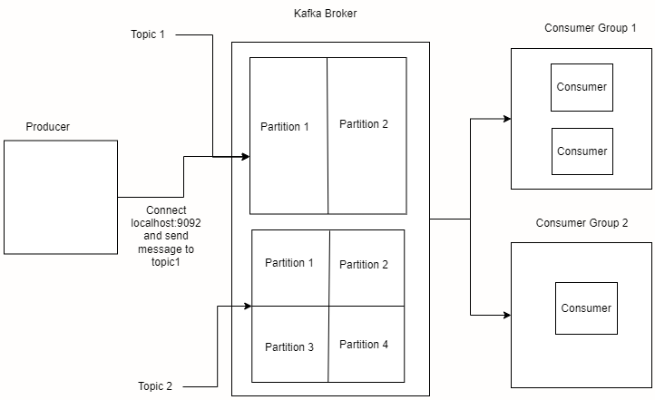

# A Beginner's Guide to Apache Kafka with Node.js and Docker Compose

If you're a Node.js developer curious about Apache Kafka, this guide is for you. We'll build a small event-driven pipeline that simulates real-time location updates — a producer publishes messages like `{ name: "User-2", location: "NORTH" }` every couple of seconds, and a consumer reads them as they arrive.

By the end of this post, you'll have:
- A local single-node Kafka cluster running in **KRaft mode** (no ZooKeeper) via Docker Compose
- A Kafka UI dashboard for inspecting topics and messages
- A working Node.js producer and consumer using `kafkajs`
- A clear mental model of brokers, topics, partitions, and consumer groups

Let's get started!

---

## Prerequisites

Before we begin, make sure you have the following installed on your machine:
- **Node.js** (v14 or higher)
- **Docker** and **Docker Compose**

---

## Kafka Crash Course

If you are totally new to Kafka, the easiest way to understand it is like a massive **Radio Broadcasting System**:
- **Broker**: The radio station itself (a single Kafka server). It is the central hub that receives messages from producers and stores them safely for consumers to read.
- **Cluster**: A group of brokers working together. Just like a national broadcasting network uses multiple stations to cover the whole country, a Kafka cluster is a network of brokers sharing the workload.
- **Producer**: The DJ (your application) broadcasting a show.
- **Topic**: The specific radio frequency or channel (e.g., `99.5 FM`) the DJ is broadcasting on.
- **Consumer**: The listener (another application) tuned into that specific frequency to hear the show.
- **Consumer Group**: A coordinated team of listeners. If a broadcast has too much information for one person to transcribe, you hire a team. Kafka ensures each message is given to only *one* person in the team so the work is perfectly divided without duplicates.
- **Partition**: If the radio station becomes so popular that one transmitter can't handle the traffic, the broadcast is split across multiple transmitters (computers) to handle the load. These splits are called partitions.
- **Offset**: A sequential ID number assigned to every message as it enters a partition. Think of it as a bookmark; it allows consumers to remember exactly which messages they have already read so they can resume from where they left off if they restart.

---
## Kafka Architecture (Producer → Broker → Consumer Group)



To read the diagram:
- A `topic` is split into **partitions**. The broker stores messages per partition.
- A **producer** writes events to a topic. The **message key** decides which partition each event goes to.
- A **consumer group** is a set of consumers that share the same `groupId`.
- Inside a consumer group, partitions are assigned to consumers so each partition is processed by only one consumer.
- Different consumer groups read the same topic independently.
- **Offsets** (bookmarks) track how far each consumer group has read in every partition.

In this tutorial, `groupId = "test-code-1"` and the producer uses `String(msg.id)` as the key, so events can land on different partitions.

---

## 1. Setting Up the Kafka Cluster

To keep our local development environment clean and reproducible, we will use **Docker** to run our Kafka broker. 

Historically, Kafka required a separate service called **ZooKeeper** to act as its brain—managing the cluster, tracking which brokers were alive, and storing metadata. 

Gone are those days! We'll use **KRaft** (Kafka Raft) mode, which builds that "brain" directly into Kafka itself. This massively simplifies the architecture by removing the ZooKeeper dependency entirely.

### Docker Compose Basics

If you are new to Docker Compose, here is a quick rundown of the basic keywords we will use:
- **`image`**: The pre-built software package we are pulling from Docker Hub (e.g., `apache/kafka:latest`).
- **`container_name`**: A custom, human-readable name for our running container.
- **`ports`**: Maps the network ports from inside the container to your local machine so your app can access them.
- **`volumes`**: Ensures our Kafka data is saved persistently on our hard drive so we don't lose messages if the container restarts.
- **`depends_on`**: Controls the startup order of your containers. We use this to tell Docker that the `kafka-ui` container shouldn't boot up until the `kafka` broker has successfully started.

### Understanding the KRaft Configuration

If you've used Kafka before, the environment variables might look completely new. Because we aren't using ZooKeeper, we rely on **KRaft**. Let's break down the most important settings:

- `KAFKA_PROCESS_ROLES: "broker,controller"`: In KRaft mode, a node can act as a broker (stores data), a controller (manages the cluster), or both. For local development, our single node acts as both.
- `KAFKA_NODE_ID` & `KAFKA_CONTROLLER_QUORUM_VOTERS`: We assign our node an ID of `1` and tell the cluster that node `1` is the sole voter for cluster management. 
- `KAFKA_LISTENER_SECURITY_PROTOCOL_MAP`: This maps our custom listener names (`CONTROLLER`, `INTERNAL`, `EXTERNAL`) to the underlying security protocol. **Note:** These listener names are completely customizable; you can use your own names as long as you map them consistently across your configuration. We use descriptive names here for clarity. In local development, we map them all to `PLAINTEXT` (unencrypted) to keep things simple.
- `KAFKA_LISTENERS` & `KAFKA_ADVERTISED_LISTENERS`: These define how clients connect to Kafka. We set up an `EXTERNAL` listener on port `9092` (so our Node.js app can connect from our host machine) and an `INTERNAL` listener on port `9094` (so Kafka UI inside the Docker network can connect to it).
- `KAFKA_INTER_BROKER_LISTENER_NAME` & `KAFKA_CONTROLLER_LISTENER_NAMES`: Kafka needs to know which "network door" is meant for what traffic. We tell it to use the `INTERNAL` listener for brokers talking to other brokers, and the `CONTROLLER` listener for the KRaft consensus (voting and cluster management) traffic. This keeps cluster management completely separate from standard data traffic.
- `KAFKA_OFFSETS_TOPIC_REPLICATION_FACTOR: 1`: By default, Kafka expects multiple nodes to safely replicate internal data (like consumer offsets). Since we only have one local node, we must force this to `1`.
- `KAFKA_TRANSACTION_STATE_LOG_REPLICATION_FACTOR: 1` & `KAFKA_TRANSACTION_STATE_LOG_MIN_ISR: 1`: Similar to the offsets, if you ever use transactional messages, Kafka needs to save the transaction state. Because it's a single node, we drop the required replication factor and Minimum In-Sync Replicas (ISR) down to `1`.

### Understanding the Kafka UI Configuration

For the `kafka-ui` service, the environment variables are much simpler:
- `KAFKA_CLUSTERS_0_NAME: local`: This assigns a human-readable name to our cluster inside the Kafka UI dashboard.
- `KAFKA_CLUSTERS_0_BOOTSTRAPSERVERS: kafka:9094`: This tells the UI how to connect to our Kafka broker. Because both containers run on the same Docker network, the UI connects to the `kafka` container using its internal Docker hostname (`kafka`) and the internal port (`9094`), which we previously configured as our `INTERNAL` listener.

Now that we understand the configuration, create a `compose.yaml` file in your project directory:

```yaml
services:
  kafka:
    image: apache/kafka:latest
    container_name: kafka
    volumes:
      - kafka_data:/var/lib/kafka/data
    ports:
      - "9092:9092"
    environment:
      KAFKA_NODE_ID: 1
      KAFKA_PROCESS_ROLES: "broker,controller"
      KAFKA_LISTENER_SECURITY_PROTOCOL_MAP: "CONTROLLER:PLAINTEXT,INTERNAL:PLAINTEXT,EXTERNAL:PLAINTEXT"
      KAFKA_CONTROLLER_QUORUM_VOTERS: "1@kafka:29093"
      KAFKA_LISTENERS: "CONTROLLER://:29093,EXTERNAL://:9092,INTERNAL://:9094"
      KAFKA_ADVERTISED_LISTENERS: "EXTERNAL://localhost:9092,INTERNAL://kafka:9094"
      KAFKA_INTER_BROKER_LISTENER_NAME: "INTERNAL"
      KAFKA_CONTROLLER_LISTENER_NAMES: "CONTROLLER"
      KAFKA_OFFSETS_TOPIC_REPLICATION_FACTOR: 1
      KAFKA_TRANSACTION_STATE_LOG_REPLICATION_FACTOR: 1
      KAFKA_TRANSACTION_STATE_LOG_MIN_ISR: 1

  kafka-ui:
    image: provectuslabs/kafka-ui:latest
    container_name: kafka-ui
    ports:
      - "8080:8080"
    environment:
      KAFKA_CLUSTERS_0_NAME: local
      KAFKA_CLUSTERS_0_BOOTSTRAPSERVERS: kafka:9094
    depends_on:
      - kafka

volumes:
  kafka_data:
```

This configuration spins up a single-node Kafka broker available at `localhost:9092` and the excellent [Kafka UI](https://github.com/provectus/kafka-ui) accessible at `localhost:8080` for monitoring your topics and messages visually.

Before starting the cluster, make sure Docker Desktop (or the Docker daemon/engine) is running so the CLI can communicate with Docker properly.

Start your cluster by running:
```bash
docker-compose up -d
```

**What happens when you run this command?**
1. **Pulls Images:** Docker first checks if you have the required images (`apache/kafka:latest` and `provectuslabs/kafka-ui:latest`) locally. If not, it pulls them from Docker Hub.
2. **Creates the Network:** Docker Compose automatically sets up a default internal network so the `kafka` and `kafka-ui` containers can communicate securely.
3. **Creates the Volume:** It provisions the `kafka_data` volume on your host machine to ensure your Kafka data persists across restarts.
4. **Starts the Containers:** It boots up the Kafka container first, followed by the Kafka UI container (thanks to our `depends_on` rule). The `-d` flag runs them in **detached** mode, meaning they run in the background, freeing up your terminal.

---

## 2. Initializing the Node.js Project

Initialize a new Node.js project and install `kafkajs`:

```bash
npm init -y
npm install kafkajs
```
*(Make sure to add `"type": "module"` in your `package.json` to use ES6 imports).*

**Why `kafkajs`?**
Because Kafka isn't built in JavaScript, our Node.js app can't talk to it directly out of the box. `kafkajs` is a popular, easy-to-use library that acts as a bridge. It gives us simple functions to connect to the Kafka broker, create topics, and send or receive messages effortlessly.

---

## 3. The Code Setup

Let's break our application into small, logical files.

### `client.js`
First, we instantiate the Kafka client. This client will be shared across our admin, producer, and consumer scripts.

```javascript
import { Kafka } from "kafkajs";

export const kafka = new Kafka({
    clientId: 'my-app',
    brokers: ['localhost:9092']
});
```

Let's quickly break down this configuration object:
- **`clientId`**: A logical identifier for your application. This is incredibly useful for debugging and tracking metrics in Kafka logs, as it tells the broker exactly which application is making requests.
- **`brokers`**: This tells our Node.js app where to find Kafka. When the app runs, it tries to connect to this broker address. Since we already exposed port `9092` to our local machine in the `compose.yaml` file, we simply point it to `localhost:9092`.

### `constant.js`
It's a good practice to keep your topic names and group IDs in a central place.

```javascript
const topic = "test1"
const groupId = "test-code-1"
export { topic, groupId }
```

Why do we need these?
- **`topic`**: This is the category or channel name where our messages will be published. The producer sends messages to `test1`, and the consumer listens to `test1` to read them.
- **`groupId`**: This acts as an identifier for a group of consumers. Kafka uses this to manage consumer load balancing—if you run multiple consumers with the same `groupId`, Kafka ensures each message is only read by one consumer in the group, preventing duplicates.


---

## 4. Topic Creation (Admin)

Before we can send or receive messages, we need a topic. The Admin API allows us to manage topics programmatically.

Create an `admin.js` file:

```javascript
import { kafka } from "./client.js";
import { topic } from "./constant.js";
let admin = null
const connectAdmin = async () => {
    try {
        console.log('Connecting :: Admin')
        admin = kafka.admin()
        await admin.connect();
        console.log('Connected :: Admin')
        await createTopic()
        console.log(await admin.listTopics())
    } catch (error) {
        console.error(error.message);
    }
    finally {
        if (admin !== null) {
            console.log("Disconnecting :: Admin ")
            await admin.disconnect()
            console.log("Disconnected :: Admin ")
        }

    }
}
const createTopic = async () => {
    try {
        if (admin != null) {
            await admin.createTopics({
                topics: [{ topic, numPartitions: 2 }],

            })
        }
    } catch (error) {
        console.log('Error :: Topic creation')
        console.error(error.message);
    }
}
connectAdmin()
```

Let's break down the important functions used here:
- **`kafka.admin()`**: This creates an Admin client instance. The Admin client is specifically used to manage the Kafka cluster infrastructure, such as creating topics, deleting topics, and checking cluster metadata.
- **`admin.connect()`**: This asynchronously connects the Admin client to the Kafka broker. It returns a Promise that resolves when the connection is successfully established.
- **`admin.createTopics({ topics: [{ topic, numPartitions: 2 }] })`**: This function tells the broker to create new topics. We pass it an array of configuration objects with two key properties:
  - `topic`: The name of the topic to create (which we imported from `constant.js` as `"test1"`).
  - `numPartitions: 2`: Partitions allow Kafka to split the topic's data for scalability and parallel processing. Here, we specify that our topic should be divided into 2 partitions.
  It returns a Promise that resolves to `true` if the topics were successfully created (or if they already exist), and throws an error if it fails.
- **`admin.listTopics()`**: This fetches a list of all topic names currently existing in your Kafka cluster. It returns a Promise that resolves to an array of strings (e.g., `['test1']`).
- **Error handling in `createTopic`**: In production code you'd typically rethrow from `createTopic` so a failed topic creation surfaces as a non-zero exit. We swallow errors here to keep the tutorial output readable.

Run this file once to create the topic:
```bash
node admin.js
```

---

## 5. Building the Producer

The producer is responsible for publishing messages to our Kafka topic. 

Create a `producer.js` file:

```javascript
import { CompressionTypes } from 'kafkajs';
import { kafka } from "./client.js";
import { topic } from "./constant.js";

const producer = kafka.producer({
    allowAutoTopicCreation: false,
    transactionTimeout: 30000
})

const directions = ['NORTH', 'SOUTH', 'EAST', 'WEST'];
const buildMessage = (id) => ({
    name: `User-${id}`,
    id,
    location: directions[Math.floor(Math.random() * directions.length)]
});

const connectProducer = async () => {
    try {
        console.log("Connecting :: Producer")
        await producer.connect()
        console.log('Connected :: Producer')
        for (let i = 1; i <= 5; i++) {
            const msg = buildMessage(i);
            await sendMessages(topic, String(msg.id), msg);
            await new Promise((r) => setTimeout(r, 1000));
        }
    } catch (error) {
        console.error(error.message)
    } finally {
        console.log("Disconnecting :: Producer")
        await producer.disconnect()
        console.log("Disconnected :: Producer")
    }
}

const sendMessages = async (topic, key, msg) => {
    try {
        if (producer != null) {
            console.log("Sending :: messages")
            const result = await producer.send({
                topic,
                messages: [{ key, value: JSON.stringify(msg) }],
                compression: CompressionTypes.GZIP
            })
            console.log("Sent :: messages", result)
        }

    } catch (error) {
        console.error(error.message)
    }
}

connectProducer()
```
Let's break down the important producer configurations and functions:
- **`kafka.producer({ allowAutoTopicCreation: false })`**: Creates the producer instance. Setting `allowAutoTopicCreation` to `false` is a best practice; it ensures the producer throws an error if it tries to send a message to a topic that doesn't exist yet, rather than silently creating it with default settings.
- **`producer.send({ topic, messages: [...] })`**: Sends an array of messages to the specified topic. The Promise resolves only *after* the broker acknowledges the write, so it's safe to disconnect the producer as soon as the loop finishes.
  - `key`: Messages with the same key are guaranteed to be sent to the same partition, which preserves their order. We use `String(msg.id)` so different users' updates can land on different partitions (matching our topic's two partitions).
  - `value`: The actual payload of the message. Kafka expects strings or buffers, so we convert our JavaScript object into a string using `JSON.stringify()`.
  - `compression`: We use `CompressionTypes.GZIP` to compress the message payload, which is highly recommended for production environments to save bandwidth and storage. On the consumer side, `kafkajs` decompresses automatically — no extra configuration needed.

---

## 6. Building the Consumer

Finally, let's create a consumer to read the messages we just produced. The consumer listens to the topic and processes incoming messages.

Create a `consumer.js` file:

```javascript
import { topic, groupId } from './constant.js'
import { kafka } from './client.js'


const consumer = kafka.consumer({ groupId })
const { HEARTBEAT } = consumer.events
consumer.on(HEARTBEAT, e => console.log(`heartbeat at ${e.timestamp}`))

process.on('SIGINT', async () => {
    console.log('\nDisconnecting :: Consumer');
    await consumer.disconnect();
    console.log('Disconnected :: Consumer');
    process.exit(0);
});

const connectConsumer = async () => {
    try {
        console.log("Connecting :: Consumer")
        await consumer.connect()
        console.log('Connected :: Consumer')
        await consumer.subscribe({ topics: [topic], fromBeginning: true })
        console.log(`Reading Messages from the topic: ${topic}`)
        await consumer.run({
            eachMessage: async ({ topic, message, heartbeat, pause }) => {
                console.log(`Key : ${message.key.toString()} -> value: ${message.value.toString()}`)
            }
        })
        console.log(`Messages Read successfully from the topic: ${topic}`)
    } catch (error) {
        console.error(error.message)
    }
}

connectConsumer()
```
Let's break down the important consumer configurations and functions:
- **`kafka.consumer({ groupId })`**: Creates a consumer instance and assigns it to a consumer group. The broker uses this `groupId` to save the "offsets" (bookmarks) for this specific group, ensuring no messages are skipped or read twice even if the consumer crashes and restarts.
- **`consumer.subscribe({ topics: [topic], fromBeginning: true })`**: Tells the consumer which topics to listen to. By setting `fromBeginning: true`, the consumer will read all available messages in the topic from the very start if it hasn't read from this topic before (i.e., if it doesn't have a saved offset bookmark).
- **`consumer.run({ eachMessage: async ({ message }) => ... })`**: Starts a continuous loop that fetches messages from the broker. For every message received, it triggers the `eachMessage` callback, providing us with the message object where we can access the `key` and `value` (which we convert back to a string using `.toString()`).
- **`SIGINT` handler**: Pressing Ctrl+C triggers a graceful disconnect so Kafka can commit final offsets and remove the consumer from the group cleanly — mirroring how we disconnect the admin and producer clients.

---

## 7. Putting it all together

Now that everything is set up, let's see it in action!

1. **Start the Consumer**: Open a terminal and run the following command to connect and wait for incoming messages:
```bash
node consumer.js
```

2. **Run the Producer**: Open a second terminal and run the following command to connect, send five simulated location updates (about 1 second apart), and disconnect:
```bash
node producer.js
```
3. **Watch the Magic**: Look back at your Consumer terminal. You should see each message printed out as it arrives.

*(Note: Because we set `fromBeginning: true` in our consumer, it actually doesn't matter which script you run first! If you run the producer first, Kafka buffers the messages, and the consumer will fetch them the moment it boots up.)*

Additionally, you can open your browser and navigate to `http://localhost:8080` to explore the **Kafka UI**. You can view your topics, partitions, and inspect the messages sent by your producer visually.

## Troubleshooting (common gotchas)

If you run into issues while following this guide, here are a few quick checks:

- **Docker errors (cannot connect to the Docker daemon)**: Make sure Docker Desktop (on Windows/macOS) or the Docker daemon/service (on Linux) is running before you run `docker-compose up -d`.
- **Ports already in use (9092 or 8080)**: Another process is listening on that port. Either stop the conflicting process or change the exposed ports in your `compose.yaml` file.
- **Node.js `ECONNREFUSED` when connecting to Kafka**: Verify that the Kafka container is healthy and that `localhost:9092` in `client.js` matches the `EXTERNAL` listener in your Docker Compose config.
- **Topic not found errors from the producer**: Make sure you’ve run `node admin.js` at least once to create the topic before running the producer, or check that the topic name in `constant.js` matches what you created.
- **Messages not appearing in the consumer**: Confirm that the consumer is subscribed to the correct topic and that you haven’t changed `groupId` between runs in a way that skips old offsets unexpectedly.

## Conclusion

Congratulations! You've successfully built a local Apache Kafka event-driven pipeline using Node.js, `kafkajs`, and Docker Compose. We covered setting up a KRaft broker, creating topics, producing messages with compression, and consuming those messages in real-time.

From here, you can explore more advanced Kafka concepts like partition strategies, consumer groups scaling, and stream processing.

## References & further reading

I used these references while writing this guide:

- **kafkajs documentation** – [https://kafka.js.org](https://kafka.js.org)
- **YouTube tutorial I followed** – [Apache Kafka Crash Course | What is Kafka?](https://www.youtube.com/watch?v=ZJJHm_bd9Zo)

Happy coding! 